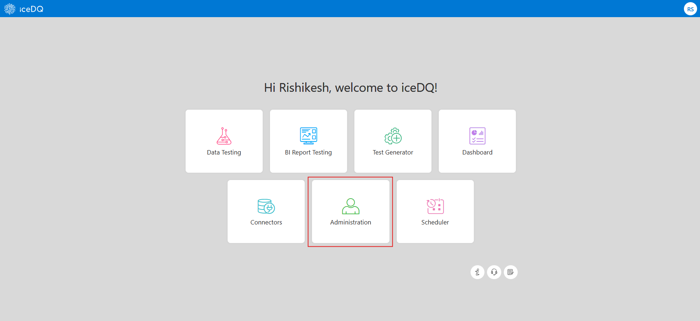
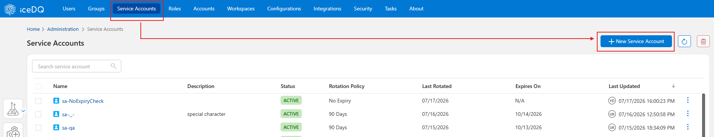
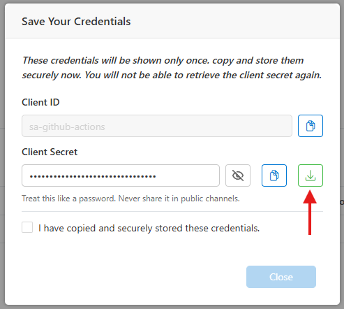
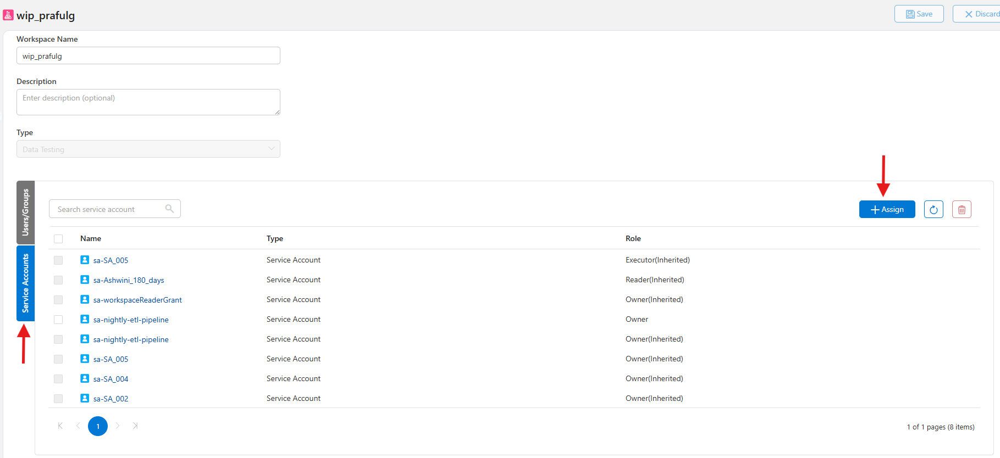
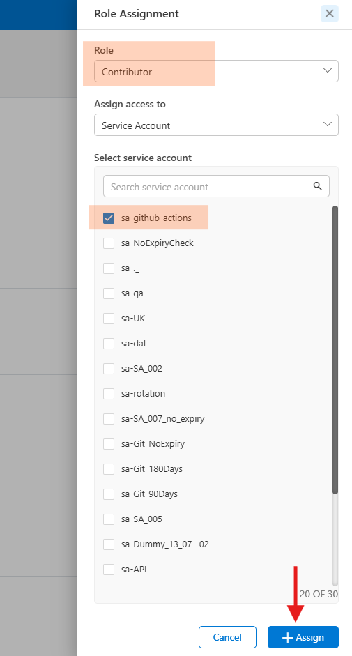
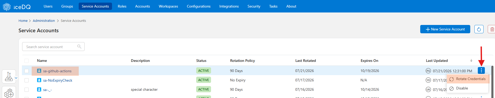

# iceDQ GitHub Actions Guide

This guide will help you get started with iceDQ's GitHub Actions to automate your resource migration tasks.

## Table of Contents

- [Available GitHub Actions](#available-github-actions)
- [Prerequisites](#prerequisites)
  - [1. Create a Service Account](#1-create-a-service-account)
  - [2. Assign Role to the Service Account](#2-assign-roles-to-the-service-account)
  - [3. Collect your iceDQ Identifiers](#3-collect-your-icedq-identifiers)
- [How to Create a Service Account](#how-to-create-a-service-account)
- [How to Assign Role to the Service Account](#how-to-assign-roles-to-the-service-account)
- [Quick Start](#quick-start)
  - [Promote a Folder](#promote-a-folder-on-every-push)
  - [Create Mapping Files](#create-mapping-files)
- [FAQs](#faqs)
  - [How to Rotate Service Account Credentials](#1-how-to-rotate-service-account-credentials)
- [References](#references)

---

## Available GitHub Actions

| Action | What it does |
|---|---|
| `icedq-tools/export-action` | Initiates an export, polls until complete, downloads the bundle ZIP, optionally uploads it as a workflow artifact. |
| `icedq-tools/generate-mapping-action` | Analyses the export bundle, queries the target workspace to auto-match connections, parameters, and custom fields by name and type, and produces a ready-to-use mapping JSON for the import action. |
| `icedq-tools/import-action` | Submits a bundle to a target workspace, polls until complete, parses the import log for skipped rules, optionally fails the workflow on any skip (strict: true). |

---

## Prerequisites

### 1. Create a Service Account

For promoting your resources from lower environment to higher, you will need to create **service account** in both environments. Follow the steps in [How to Create a Service Account](#how-to-create-a-service-account) section below.

> **Note:** Service accounts are available from **iceDQ version 7.8.0** and above.

**Recommendation:** Create one service account per environment (Dev, QA, UAT, Prod).

### 2. Assign Roles to the Service Account

You are required to provide appropriate role to each service account to Export or Import resources.

| Action | Minimum required Role |
|---|---|
| Export | Reader |
| Generate Mapping | Contributor |
| Import | Contributor |

Follow the steps in [How to Assign Roles to the Service Account](#how-to-assign-roles-to-the-service-account) section below.

### 3. Collect your iceDQ identifiers

You'll need these for each environment of your iceDQ application:

- **Org ID**
- **Account ID**
- **Workspace ID**
- **iceDQ instance URL**
- **Keycloak URL** — base URL up to the realm name, e.g. `https://auth.example.com/realms/icedq`

## How to Create a Service Account

### Step 1: Go to the iceDQ Administration

Log in and navigate to **Administration** section.



### Step 2: Open the Service Accounts tab

1. Inside Administration, go to **Service Accounts** tab.
2. Click on **+New Service Account**

    

### Step 3: Create New Service Account

1. Provide a name for your account after **sa-**
2. Select credential's **Rotation Policy**
3. Click **Save**

You will now see a pop-up dialog. Here, you can either copy your Client ID and Secret or Download it.



> ❗**Important:** **Client Secret** will be shown only once. So, either copy and save it securely or download it.


## How to Assign Roles to the Service Account

### Step 1: Decide Where to Assign

First, decide if you want to assign the service account to a workspace or an account.

Steps 2 to 3 are the same whether you assign to a Workspace or an Account. Below steps show assigning to a Workspace.

### Step 2: Open your Workspace

1. Navigate to the **Workspaces** tab.
2. Open your workspace and go to **Service Accounts** section.
3. Click on **+Assign**.

    

### Step 3: Assign Role

1. Select appropriate **Role**:
   - **SOURCE workspace** — from where you want to export the resource → assign `Reader` role

   - **TARGET workspace** — where you want to import the resource → assign `Contributor` role

2. Select the created Service Account.
3. Click **+Assign**

    

---


## Quick Start

### Promote a Folder on every push

```yaml
# .github/workflows/promote-folder.yml
name: Promote Folder from DEV to UAT

on:
  push:
    branches: [main]
  workflow_dispatch:

jobs:
  export:
    runs-on: ubuntu-latest
    environment: DEV
    outputs:
      task-id:     ${{ steps.export.outputs.task-id }}
      status:      ${{ steps.export.outputs.status }}
      bundle-path: ${{ steps.export.outputs.bundle-path }}
    steps:
      - name: Checkout repo
        uses: actions/checkout@v4

      - name: Export folder from DEV environment
        id: export
        uses: icedq-tools/export-action@v1
        with:
          icedq-url:       ${{ vars.ICEDQ_URL }}
          keycloak-url:    ${{ vars.ICEDQ_KEYCLOAK_URL }}
          org-id:          ${{ vars.ICEDQ_ORG_ID }}
          client-id:       ${{ secrets.ICEDQ_CLIENT_ID }}
          client-secret:   ${{ secrets.ICEDQ_CLIENT_SECRET }}
          account-id:      ${{ vars.ICEDQ_ACCOUNT_ID }}
          workspace-id:    ${{ vars.ICEDQ_WORKSPACE_ID }}
          resource:        workflow    # 'workflow' is the iceDQ resource type for folders
          id:              ${{ vars.FINANCE_FOLDER_ID }}
          include-child:   true
          output-file:     ./exports/finance.zip
          artifact-name:   icedq-finance-folder-bundle

  generate-mapping:
    runs-on: ubuntu-latest
    needs: export
    environment: UAT
    outputs:
      mapping-file: ${{ steps.generate.outputs.mapping-file }}
    steps:
      - name: Download bundle from export job
        uses: actions/download-artifact@v4
        with:
          name: icedq-finance-folder-bundle
          path: ./exports

      - name: Generate mapping for UAT environment
        id: generate
        uses: icedq-tools/generate-mapping-action@v1
        with:
          icedq-url:      ${{ vars.ICEDQ_URL }}
          keycloak-url:   ${{ vars.ICEDQ_KEYCLOAK_URL }}
          org-id:         ${{ vars.ICEDQ_ORG_ID }}
          client-id:      ${{ secrets.ICEDQ_CLIENT_ID }}
          client-secret:  ${{ secrets.ICEDQ_CLIENT_SECRET }}
          account-id:     ${{ vars.ICEDQ_ACCOUNT_ID }}
          workspace-id:   ${{ vars.ICEDQ_WORKSPACE_ID }}
          bundle:         ./exports/finance.zip
          output-file:    ./mapping/finance-folder-mapping.json
          artifact-name:  icedq-finance-folder-mapping

  import:
    runs-on: ubuntu-latest
    needs: [export, generate-mapping]
    environment: UAT
    steps:
      - name: Download bundle from export job
        uses: actions/download-artifact@v4
        with:
          name: icedq-finance-folder-bundle
          path: ./exports

      - name: Download generated mapping
        uses: actions/download-artifact@v4
        with:
          name: icedq-finance-folder-mapping
          path: ./mapping

      - name: Import folder into UAT environment
        uses: icedq-tools/import-action@v1
        with:
          icedq-url:             ${{ vars.ICEDQ_URL }}
          keycloak-url:          ${{ vars.ICEDQ_KEYCLOAK_URL }}
          org-id:                ${{ vars.ICEDQ_ORG_ID }}
          client-id:             ${{ secrets.ICEDQ_CLIENT_ID }}
          client-secret:         ${{ secrets.ICEDQ_CLIENT_SECRET }}
          account-id:            ${{ vars.ICEDQ_ACCOUNT_ID }}
          workspace-id:          ${{ vars.ICEDQ_WORKSPACE_ID }}
          bundle:                ./exports/finance.zip
          kind:                  workflows    # 'workflows' maps to the folder resource type on import
          mapping-file:          ./mapping/finance-folder-mapping.json
          strict:                false
          terminate-on-conflict: true
```

**Notes on this pipeline:**
- The `generate-mapping` job runs against the **UAT environment** because it needs to query TARGET workspace to auto-match connections by name and type.
- You can further extend this pipeline to promote the same artifact bundle through all your environments — no re-export per environment, ensuring identical bytes are imported everywhere.
- `strict: 'true'` fails the job if any rule is skipped (e.g., a missing target connection). The next environment is gated on `needs:` so failures stop the chain.

### Create Mapping Files

The `import-action` requires a `mapping-file` that tells it how to re-link source connections, parameters, and custom fields to their counterparts in the target workspace. There are two ways to produce this file.

#### Option 1 (recommended) — Auto-generate with `generate-mapping-action`

Use `icedq-tools/generate-mapping-action` as a middle job between export and import. It queries the target workspace, matches resources by name and connector type, and writes a ready-to-use mapping JSON automatically. See the [Quick start](#quick-start) example for a complete pipeline.

> If a connection cannot be matched automatically (e.g. different name in target), you can still fall back to a manual mapping for that specific entry.

#### Option 2 — Manual mapping file

Manually author a JSON file and commit it to the repo (e.g. `mappings/uat.json`). Pass its path via the `mapping-file` input of the import action. Useful when auto-matching can't resolve all entries or you need explicit control over every override. In this case, you do not need to add `generate-mapping-action` as a middle job between export and import.

### Mapping file syntax

```json
{
  "useFqn": false,
  "mapping": {
    "connections": [
      {
        "existingId": "conn-source-uuid", // id from source environment
        "newId":      "conn-target-uuid", // id from target environment
        "action":     "override"
      }
    ],
    "parameters": [
      {
        "existingId": "parm-source-uuid",
        "action":     "append"
      }
    ],
    "customFields": [
      {
        "existingId": "source-field-name",
        "newId":      "target-field-name",
        "action":     "override"
      }
    ]
  }
}
```

### Mapping Field Reference

| Object | Supported actions | What each does |
|---|---|---|
| Connections | `override` only | Re-link rules in the target to use `newId` instead of the source's `existingId`. Target connection must already exist. |
| Custom fields | `override` only | Same as connections. Target field must already exist. |
| Parameters | `append`, `override`, `upsert` | `append`: add new parameter keys to target without overwriting existing values. `override`: target parameter must already exist. `upsert`: overwrites all matching keys and appends others. **In production**, always specify `append`, `override` or `upsert` explicitly. |
| useFqn | `true`, `false` | `false`: asset with same name doesn't already exist in the target environment. `true`: an asset with same name does exist in target. |

### Tip: keep mappings under version control

Store mapping files in your repo (e.g., `mappings/qa.json`, `mappings/uat.json`, `mappings/prod.json`) so changes to UUID mappings are auditable and reviewable in PRs.

---


## FAQs

### 1. How to Rotate Service Account Credentials
1. Go to **Service Accounts** section.
2. Find your service account and click on three-dots on the right hand side.
3. Click **Rotate Credentials**

    
4. You will see a pop-up dialog. Either copy the new **Client Credentials** or download as a file.

> ⚠️ Make sure to rotate your credentials before expiry to avoid service interruption.

## References

| Action | Documentation |
|---|---|
| export-action | [View Documentation](https://github.com/icedq-tools/export-action#icedq-toolsexport-action) |
| generate-mapping-action | [View Documentation](https://github.com/icedq-tools/generate-mapping-action#icedq-toolsgenerate-mapping-action) |
| import-action | [View Documentation](https://github.com/icedq-tools/import-action#icedqimport-action) |