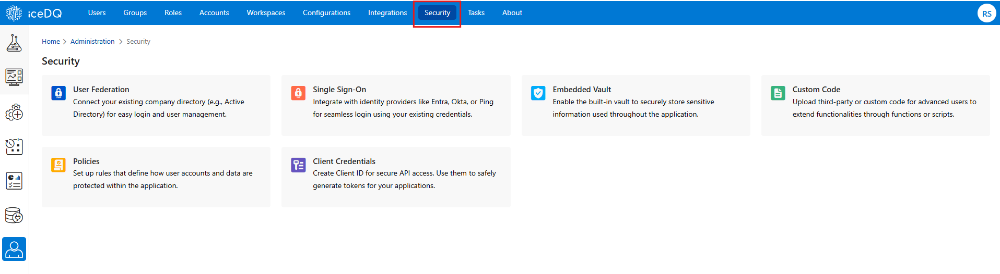
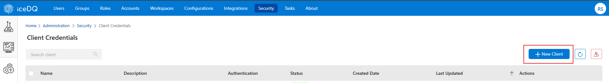
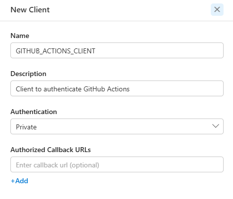
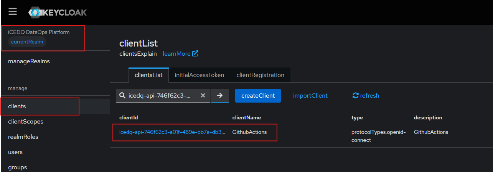
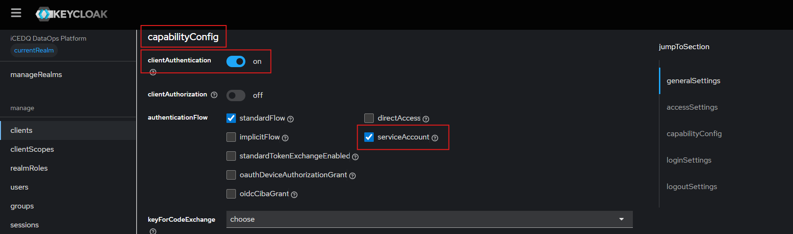
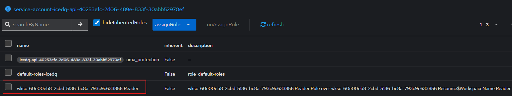
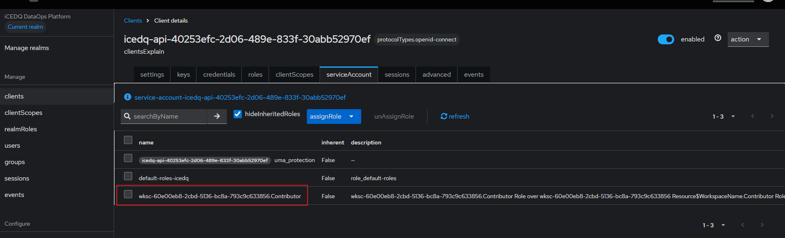

# iceDQ GitHub Actions Guide

This guide will help you get started with iceDQ's GitHub Actions to automate your resource promotion tasks.

## Available GitHub Actions

| Action | What it does |
|---|---|
| `icedq-tools/export-action` | Initiates an export, polls until complete, downloads the bundle ZIP, optionally uploads it as a workflow artifact. |
| `icedq-tools/import-action` | Submits a bundle to a target workspace, polls until complete, parses the import log for skipped rules, optionally fails the workflow on any skip (strict: true). |

---

## Prerequisites

### 1. Generate Client ID and Client Secret

For promoting your resources from lower environment to higher, you will need to create client credentials in both environments. Follow the steps in [How to Get Client ID and Secret](#how-to-get-client-id-and-secret) section below.

> **Recommendation:** Create one client per environment (Dev, QA, UAT, Prod).

### 2. Configure the client ID

You are required to provide appropriate role to each Client to Export or Import resources.

| Action | Role |
|---|---|
| Export | Reader |
| Import | Contributor |

Follow the steps in [How to configure Client ID](#how-to-configure-client) section below.

### 3. Collect your iceDQ identifiers

You'll need these for each environment of your iceDQ application:

- **Org ID**
- **Account ID**
- **Workspace IDs**
- **iceDQ instance URL**
- **Keycloak URL** — base URL up to the realm path, e.g. `https://auth.example.com/realms/icedq`

## How to Get Client ID and Secret

### Step 1: Go to the iceDQ Homepage

Log in and navigate to **Administration**.


### Step 2: Open the Security Section

Inside Administration, click on **Security**.


### Step 3: Go to Client Credentials

In the Security tab, click on **Client Credentials**.

### Step 4: Create a New Client

Click the **+ New Client** button on the top right.


### Step 5: Fill in the Details and Generate Credentials

Enter a **Name** and **Description** for your client, keep the **Authentication** as **Private**, then click **Save**.


> ❗**Important:** Copy and save the **Client Secret** securely as it will be shown only once.


## How to configure Client

Steps 1 to 3 are same for SOURCE and TARGET environment.
### Step 1: Open Keycloak admin console

1. Login to Keycloak.
2. Click on **manageRealms** in top-left corner and select your realm.

### Step 2: Open your client

1. Navigate to **clients** section.
2. Search for your client ID and open it.
    

### Step 3: Update Capability Configurations

1. Go to the **Settings** tab and scroll down to **capabilityConfig** section.
2. Make sure below 2 configs are set as mentioned:
   - **clientAuthentication** is **On**
   - **serviceAccount** checkbox is **ticked**

    

3. Click **Save**.

### Step 4: Update Service Account Configurations

1. Go to the **serviceAccounts** tab.
2. Click on **assignRole** dropdown-button and select **realmRoles**.
3. Search for your workspace ID.
4. Assign the following realm role:
   - **SOURCE workspace** — from where you want to export the resource → assign `Reader` role
   
    

   - **TARGET workspace** — where you want to import the resource → assign `Contributor` role

    

---


## Quick start

### Promote a Folder on every push

```yaml
# .github/workflows/promote-folder.yml
name: Promote Folder from DEV to UAT

on:
  push:
    branches: [main]
  workflow_dispatch:

jobs:
  export:
    runs-on: ubuntu-latest
    environment: DEV
    outputs:
      task-id:     ${{ steps.export.outputs.task-id }}
      status:      ${{ steps.export.outputs.status }}
      bundle-path: ${{ steps.export.outputs.bundle-path }}
    steps:
      - name: Checkout repo
        uses: actions/checkout@v4

      - name: Export folder from DEV environment
        id: export
        uses: icedq-tools/export-action@v1
        with:
          icedq-url:       ${{ vars.ICEDQ_URL }}
          keycloak-url:    ${{ vars.ICEDQ_KEYCLOAK_URL }}
          org-id:          ${{ vars.ICEDQ_ORG_ID }}
          client-id:       ${{ secrets.ICEDQ_CLIENT_ID }}
          client-secret:   ${{ secrets.ICEDQ_CLIENT_SECRET }}
          account-id:      ${{ vars.ICEDQ_ACCOUNT_ID }}
          workspace-id:    ${{ vars.ICEDQ_WORKSPACE_ID }}
          resource:        workflow    # 'workflow' is the iceDQ resource type for folders
          id:              ${{ vars.FINANCE_FOLDER_ID }}
          include-child:   true
          output-file:     ./exports/finance.zip
          artifact-name:   icedq-finance-folder-bundle

  import:
    runs-on: ubuntu-latest
    needs: export
    environment: UAT
    steps:
      - name: Checkout repo (for mapping file)
        uses: actions/checkout@v4

      - name: Download bundle from export job
        uses: actions/download-artifact@v4
        with:
          name: icedq-finance-folder-bundle
          path: ./exports

      - name: Import folder into UAT environment
        uses: icedq-tools/import-action@v1
        with:
          icedq-url:             ${{ vars.ICEDQ_URL }}
          keycloak-url:          ${{ vars.ICEDQ_KEYCLOAK_URL }}
          org-id:                ${{ vars.ICEDQ_ORG_ID }}
          client-id:             ${{ secrets.ICEDQ_CLIENT_ID }}
          client-secret:         ${{ secrets.ICEDQ_CLIENT_SECRET }}
          account-id:            ${{ vars.ICEDQ_ACCOUNT_ID }}
          workspace-id:          ${{ vars.ICEDQ_WORKSPACE_ID }}
          bundle:                ./exports/finance.zip
          kind:                  workflows    # 'workflows' maps to the folder resource type on import
          mapping-file:          ./mappings/folder-migration-mapping-uat.json
          strict:                false
          terminate-on-conflict: true
```

**Notes on this pipeline:**
- You can further extend this pipeline with more steps to promote the same artifact bundle through all your environments — no re-export per environment, ensuring identical bytes are imported everywhere, meeting industry standard for deployments.
- Each environment has its own `mapping-file` (refer [Create mapping files](#create-mapping-files)) because target connection/parameter UUIDs differ per workspace.
- `strict: 'true'` fails the job if any rule is skipped (e.g., a missing target connection). The next environment is gated on `needs:` so failures stop the chain.

## Create mapping files

In v0.1, the import-action requires a manually created mapping JSON file (`mapping-file` input). Auto-generation action by name (`icedq-tools/generate-mapping`) ships in v0.2. Check your action's `uses:` tag (e.g., `@v1`) to determine your version.

### Mapping file syntax

```json
{
  "useFqn": false,
  "mapping": {
    "connections": [
      {
        "existingId": "conn-source-uuid", // id from source environment
        "newId":      "conn-target-uuid", // id from target environment
        "action":     "override"
      }
    ],
    "parameters": [
      {
        "existingId": "parm-source-uuid",
        "action":     "append"
      }
    ],
    "customFields": [
      {
        "existingId": "field-source-uuid",
        "newId":      "field-target-uuid",
        "action":     "override"
      }
    ]
  }
}
```

### Action semantics

| Object | Supported actions | What each does |
|---|---|---|
| Connections | `override` only | Re-link rules in the target to use `newId` instead of the source's `existingId`. Target connection must already exist. |
| Custom fields | `override` only | Same as connections. Target field must already exist. |
| Parameters | `append`, `override`, `upsert` | `append`: add new parameter keys to target without overwriting existing values. `override`: target parameter must already exist. `upsert`: overwrites all matching keys and appends others. **In production**, always specify `append`, `override` or `upsert` explicitly. |
| useFqn | `true`, `false` | `false`: asset with same name doesn't already exist in the target environment. `true`: an asset with same name does exist in target. |

### Tip: keep mappings under version control

Store mapping files in your repo (e.g., `mappings/qa.json`, `mappings/uat.json`, `mappings/prod.json`) so changes to UUID mappings are auditable and reviewable in PRs.

---


## Action inputs

You can visit respective github repositories of these actions for input parameters details.
| Action | Usage Link |
|---|---|
| export-action | https://github.com/icedq-tools/export-action#icedq-toolsexport-action |
| import-action | https://github.com/icedq-tools/import-action#icedqimport-action |