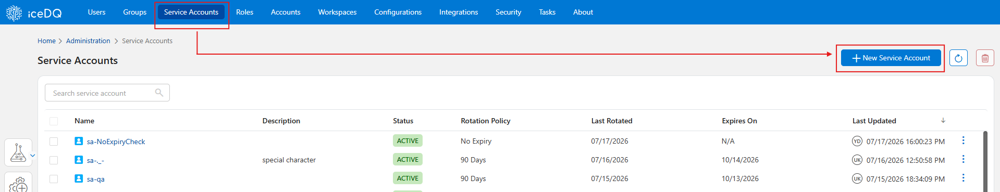
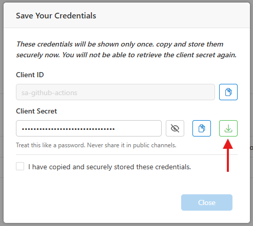
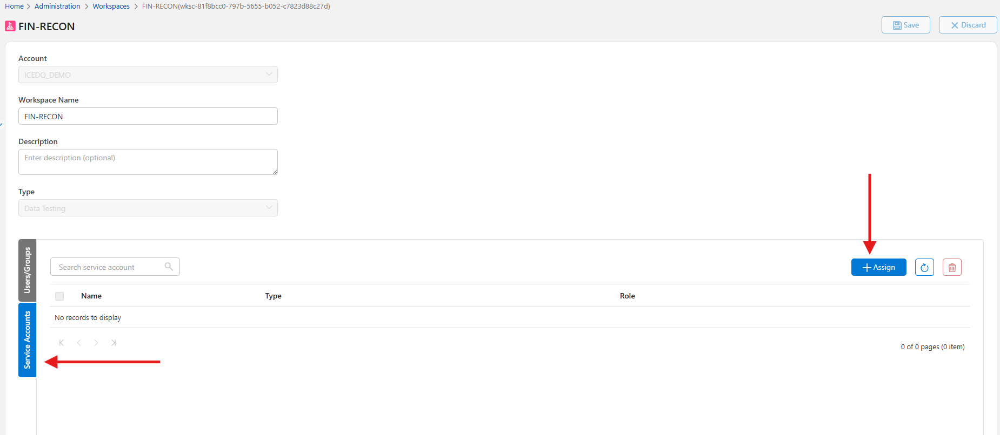
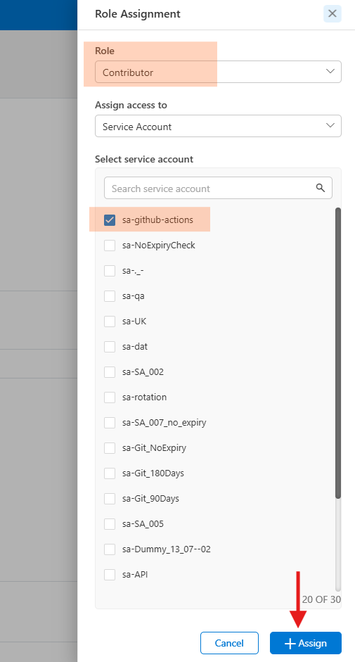
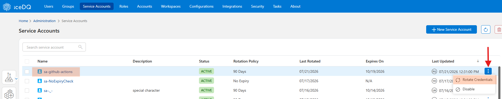

# Service Account

Service accounts in iceDQ are non-human identities used to authenticate automated tools, pipelines, and integrations. Unlike user accounts, they are not tied to a person — they authenticate using a Client ID and Client Secret, and can be granted scoped roles in a specific workspace or account.

## How To: Create a Service Account

1. Navigate to the Administration module.

2. Select the **Service Accounts** tab to create a new Service Account.

3. Click on **New Service Account**

    

4. Configure New Service Account

    a. Provide a name for your account after **sa-**

    b. Select credential's **Rotation Policy**

    c. Click **Save**

    You will now see a pop-up dialog. Here, you can either copy your Client ID and Secret or download it.

    

> ❗**Important:** **Client Secret** will be shown only once. So, either copy and save it securely or download it.

---

## How To: Assign Role to the Service Account

1. Decide Where to Assign

    First, decide if you want to assign the service account to a workspace or an account.

    Steps 2 and 3 are the same whether you assign to a Workspace or an Account. Below steps show assigning to a Workspace.

2. Navigate to the Administration module.

3. Select the **Workspaces** tab.

4. Open your workspace and go to **Service Accounts** section.

5. Click on **Assign**.

    

6. Select appropriate **Role** (based on least privilege).

7. Select the appropriate Service Account.

8. Click **Assign** to save.

    

---

## How To: Rotate Service Account Credentials

1. Navigate to the Administration module. 
2. Open **Service Accounts** section.
3. Find your service account and click on three-dots on the right hand side.
4. Click **Rotate Credentials**

    
5. You will see a pop-up dialog. Either copy the new **Client Credentials** or download as a file.

> ⚠️ Make sure to rotate your credentials before expiry to avoid service interruption.
